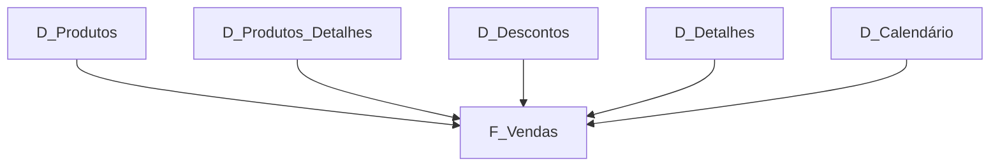

# 📊 Modelagem Dimensional — Financial Sample | Star Schema

## 📌 Sobre o projeto

Este projeto apresenta a construção conceitual de um modelo dimensional em **Star Schema (Esquema Estrela)** utilizando a tabela única **Financial Sample** como origem.

O desafio propõe partir da tabela original, realizar cópias e transformações no Power Query e organizar os dados em **tabelas dimensão e tabela fato**, preparando a estrutura para análises de vendas em Business Intelligence.

A proposta deste repositório documenta a organização do modelo, as transformações previstas, a dimensão calendário, a lógica de criação das tabelas e as funcionalidades utilizadas no processo.

> **Observação:** este repositório documenta a solução e a estrutura do projeto. O arquivo `.pbix` não foi incluído porque a implementação foi realizada sem acesso ao Power BI Desktop nesta etapa.

---

## 🎯 Objetivos

- Transformar a tabela única Financial Sample em um modelo dimensional.
- Aplicar o conceito de Star Schema.
- Criar tabelas dimensão a partir da tabela original.
- Criar uma tabela fato para vendas.
- Criar uma dimensão calendário com DAX.
- Organizar chaves e atributos para facilitar análises.
- Aplicar agrupamentos e colunas condicionais no Power Query.
- Documentar as etapas do processo para utilização em Power BI.
- Criar uma estrutura de projeto adequada para portfólio e futuras análises.

---

## 🗂️ Estrutura do modelo

A estrutura proposta pelo desafio é composta por:

- `Financials_origem` — cópia de segurança da tabela original, mantida oculta no modelo.
- `D_Produtos` — dimensão de produtos com informações agregadas.
- `D_Produtos_Detalhes` — dimensão com detalhes comerciais e produtivos dos produtos.
- `D_Descontos` — dimensão relacionada aos descontos.
- `D_Detalhes` — dimensão complementar com informações que não foram contempladas nas demais dimensões.
- `D_Calendário` — dimensão de datas criada com DAX.
- `F_Vendas` — tabela fato responsável por centralizar as informações de vendas.

---

## ⭐ Star Schema



A tabela `F_Vendas` ocupa a posição central do modelo e recebe as chaves e informações necessárias para relacionar as diferentes dimensões.

---

## 📦 D_Produtos

A dimensão `D_Produtos` é criada a partir da tabela original com agrupamento por produto.

Campos previstos:

- `ID_Produto`
- `Produto`
- `Média de Unidades Vendidas`
- `Média do valor de vendas`
- `Mediana do valor de vendas`
- `Valor máximo de Venda`
- `Valor mínimo de Venda`

O agrupamento permite transformar registros transacionais em informações consolidadas por produto.

As agregações previstas incluem:

- Média de `Units Sold`;
- Média de `Sale Price`;
- Mediana de `Sale Price`;
- Máximo de `Sale Price`;
- Mínimo de `Sale Price`.

---

## 🧾 D_Produtos_Detalhes

A dimensão `D_Produtos_Detalhes` concentra atributos relacionados aos produtos e suas características comerciais.

Campos previstos:

- `ID_Produto`
- `Discount Band`
- `Sale Price`
- `Units Sold`
- `Manufacturing Price`

Essa dimensão permite detalhar as características de venda e fabricação relacionadas aos produtos.

---

## 💰 D_Descontos

A dimensão `D_Descontos` concentra informações relacionadas à política de descontos.

Campos previstos:

- `ID_Produto`
- `Discount`
- `Discount Band`

Ela permite analisar os produtos considerando diferentes faixas e valores de desconto.

---

## 🔎 D_Detalhes

A `D_Detalhes` é uma dimensão complementar.

Sua finalidade é receber informações relevantes que não tenham sido contempladas nas demais dimensões e que forneçam maior detalhamento para a análise das vendas.

A definição final dos campos deve ser feita após a análise da tabela original e da distribuição dos atributos entre as demais dimensões.

---

## 📅 D_Calendário

A dimensão `D_Calendário` é criada por DAX utilizando a função `CALENDAR()`.

Ela fornece uma estrutura própria para análises temporais.

Exemplo:

```DAX
D_Calendário =
ADDCOLUMNS(
    CALENDAR(
        DATE(2018, 1, 1),
        DATE(2020, 12, 31)
    ),
    "Ano", YEAR([Date]),
    "Mês", MONTH([Date]),
    "Nome_Mês", FORMAT([Date], "MMMM"),
    "Trimestre", "T" & FORMAT([Date], "Q"),
    "Semestre", "S" & IF(MONTH([Date]) <= 6, 1, 2)
)
```

> As datas inicial e final devem ser ajustadas ao intervalo efetivamente existente na coluna `Date` da Financial Sample.

A dimensão pode ser utilizada para:

- Ano;
- Trimestre;
- Semestre;
- Mês;
- Nome do mês;
- Dia;
- Análises de evolução temporal.

---

## 💵 F_Vendas

A tabela `F_Vendas` representa a tabela fato do modelo.

Campos previstos no desafio:

- `SK_ID`
- `ID_Produto`
- `Produto`
- `Units Sold`
- `Sales Price`
- `Discount Band`
- `Segment`
- `Country`
- `Salers`
- `Profit`
- `Date`

A tabela fato concentra as informações necessárias para análise das vendas e mantém os campos de ligação com as dimensões.

---

## 🔑 SK_ID e ID_Produto

O campo `SK_ID` funciona como identificador técnico da ocorrência na tabela fato.

O campo `ID_Produto` identifica o produto e permite relacionar os registros da fato às informações presentes nas dimensões de produto.

A criação de um índice para produtos pode ser utilizada para auxiliar na identificação e organização dos registros.

---

## 🔄 Transformações realizadas/propostas no Power Query

O processo parte de uma cópia da tabela original.

A tabela original é preservada como:

`Financials_origem`

Essa cópia funciona como backup e pode permanecer oculta no modelo final.

A partir dela são criadas as consultas das dimensões e da tabela fato.

### 1. Cópia da tabela original

A primeira etapa é duplicar a consulta original e manter uma versão de backup denominada:

`Financials_origem`

### 2. Criação das dimensões

As consultas são duplicadas a partir da origem e cada nova tabela mantém somente os campos necessários à sua finalidade.

### 3. Agrupamento de produtos

Para `D_Produtos`, utiliza-se o recurso **Agrupar Por**.

As agregações previstas são:

- Contagem de registros;
- Mínimo de `Sale Price`;
- Máximo de `Sale Price`;
- Média de `Sale Price`;
- Mediana de `Sale Price`;
- Média de `Manufacturing Price`.

Também é prevista a média de `Units Sold`, conforme especificação da dimensão.

### 4. Criação de coluna condicional

Pode ser criada uma coluna de índice para os produtos utilizando uma regra condicional baseada no campo `Product`.

Exemplo conceitual:

| Produto | Índice |
|---|---:|
| Carretera | 0 |
| Montana | 1 |
| Paseo | 2 |
| Velo | 3 |
| VTT | 4 |
| Amarilla | 5 |

A regra deve ser aplicada de forma consistente em todas as tabelas que necessitarem da identificação do produto.

### 5. Reorganização das colunas

As colunas são reorganizadas para manter uma sequência lógica, priorizando identificadores, atributos descritivos, métricas e datas.

### 6. Criação da tabela fato

A tabela `F_Vendas` recebe os campos definidos no desafio e funciona como o centro do modelo dimensional.

---

## 🧮 Agregações

As agregações utilizadas na dimensão de produtos são:

**Média de unidades vendidas**

```text
AVERAGE(Units Sold)
```

**Média do preço de venda**

```text
AVERAGE(Sale Price)
```

**Mediana do preço de venda**

```text
MEDIAN(Sale Price)
```

**Maior preço de venda**

```text
MAX(Sale Price)
```

**Menor preço de venda**

```text
MIN(Sale Price)
```

Essas operações são realizadas no processo de agrupamento para produzir uma visão consolidada por produto.

---

## 📐 Relacionamentos

A lógica do modelo deve seguir o princípio de que as dimensões fornecem contexto para a tabela fato.

De forma conceitual:

```text
D_Produtos            1 ───── N
D_Produtos_Detalhes   1 ───── N
D_Descontos           1 ───── N
D_Detalhes            1 ───── N
D_Calendário          1 ───── N
                              │
                              ▼
                           F_Vendas
```

Os relacionamentos exatos devem ser definidos de acordo com as chaves resultantes das transformações.

---

## 📊 Possibilidades de análise

Após a implementação no Power BI, o modelo poderá apoiar análises como:

- Vendas por produto;
- Unidades vendidas por produto;
- Preço médio de venda;
- Descontos por produto;
- Lucro por produto;
- Lucro por país;
- Vendas por segmento;
- Evolução das vendas ao longo do tempo;
- Comparação de produtos;
- Análise de faixas de desconto;
- Comparação entre preço de venda e preço de fabricação.

---

## 📈 Sugestão de dashboard

Uma página inicial pode apresentar:

### Indicadores

- Total de vendas;
- Total de unidades vendidas;
- Total de lucro;
- Preço médio de venda.

### Gráficos

**Vendas por Produto**

Gráfico de barras com produto no eixo e vendas como valor.

**Lucro por Produto**

Gráfico de barras para comparação do lucro entre produtos.

**Vendas por País**

Mapa ou gráfico de barras.

**Vendas por Segmento**

Gráfico de colunas ou rosca.

**Evolução Temporal**

Gráfico de linhas utilizando `D_Calendário`.

**Desconto por Produto**

Gráfico comparando produto e faixa/valor de desconto.

---

## 🧠 DAX

O principal cálculo estrutural previsto no desafio é a criação da dimensão calendário.

Arquivo:

`dax/D_Calendario.dax`

Também podem ser criadas medidas analíticas após a implementação física do modelo.

Exemplos:

```DAX
Total Vendas =
SUMX(
    F_Vendas,
    F_Vendas[Units Sold] * F_Vendas[Sales Price]
)
```

```DAX
Total Unidades =
SUM(F_Vendas[Units Sold])
```

```DAX
Total Lucro =
SUM(F_Vendas[Profit])
```

```DAX
Preço Médio =
AVERAGE(F_Vendas[Sales Price])
```

> As medidas acima são sugestões para a etapa de análise e devem ser validadas conforme os tipos e significados dos campos presentes no modelo implementado.

---

## 🛠️ Tecnologias e conceitos

- Power BI;
- Power Query;
- DAX;
- Modelagem Dimensional;
- Star Schema;
- Data Warehouse;
- ETL;
- Tabela Fato;
- Tabelas Dimensão;
- Agregações;
- Colunas condicionais;
- Índices;
- Dimensão Calendário;
- Business Intelligence.

---

## 📁 Estrutura do repositório

```text
modelagem-financials-star-schema/
│
├── README.md
│
├── dax/
│   └── D_Calendario.dax
│
├── docs/
│   ├── modelo-dimensional.md
│   └── transformacoes-power-query.md
│
└── referencias/
    ├── consultas-financials.png
    ├── agrupamento-produtos.png
    ├── coluna-condicional.png
    └── reorganizacao-colunas.png
```

---

## 📚 Referência do desafio

O projeto foi estruturado com base no material do desafio, que orienta a criação das dimensões `D_Produtos`, `D_Produtos_Detalhes`, `D_Descontos`, `D_Detalhes`, `D_Calendário` e da tabela fato `F_Vendas`, além da preservação de `Financials_origem` como backup. O material também recomenda salvar o projeto, uma imagem do esquema em estrela e documentar o processo no README.

---

## 👩‍💻 Autora

**Luana Goulart**

Projeto desenvolvido para fins educacionais e de portfólio, com foco em **Business Intelligence, Power BI, Power Query, DAX e Modelagem Dimensional**.

---

⭐ Projeto desenvolvido como parte da jornada de aprendizagem em Data Analytics e Business Intelligence.
